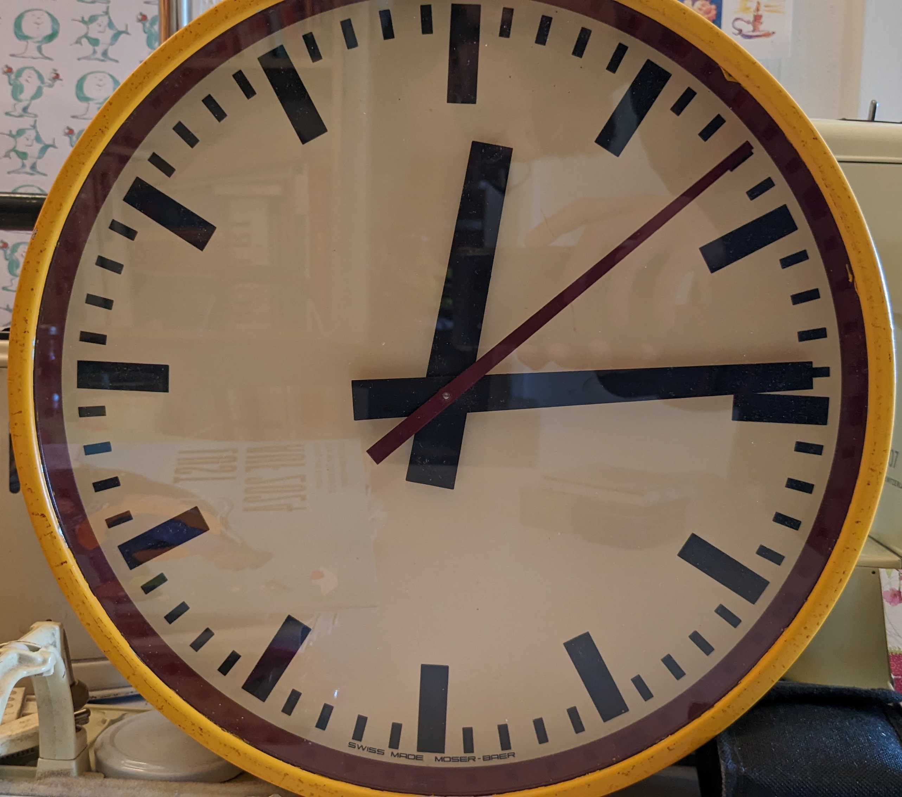
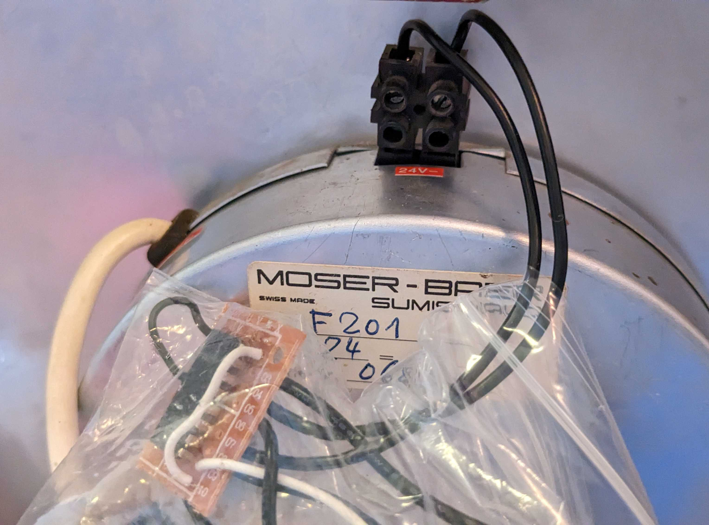
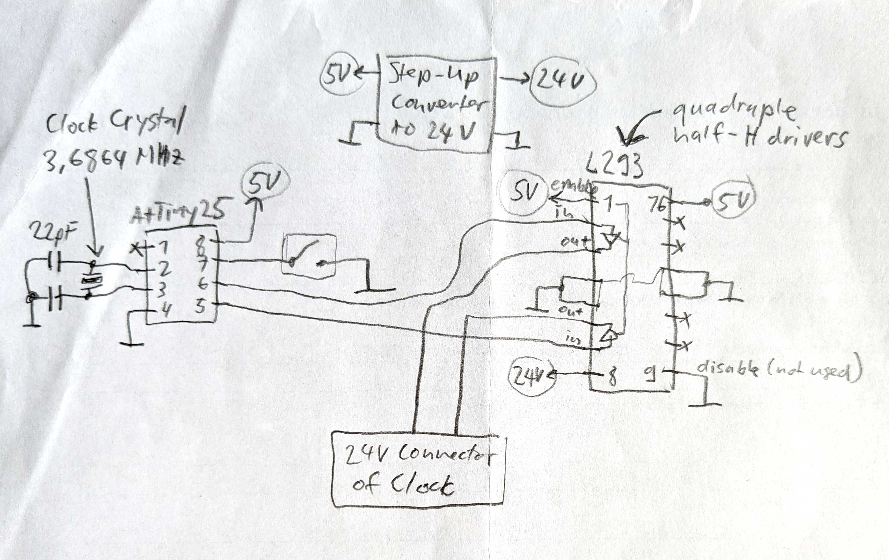

# Swiss wall clock controller

This is a wall clock controller for old Swiss train station clocks

The second hand of the clock then takes 58 seconds for a full circle, then it waits 2 seconds for the inverting signal that triggers the jump to the next minute and releases the second hand. The 24 volts trigger input of the clock reacts to an invertion of the voltage. A H-Bridge is used to achieve this behavior and to amplify to 24 volts.

https://github.com/schaum/swiss-clock-control/assets/4143984/d9658beb-b59b-42b7-83d2-0b71d53ebf72

The controller sends every minute a trigger signal to keep the clock running. The circuit contains a button to reset the ongoing seconds to 0, to manually trigger the jump of the minute hand and to set the local time quickly.

## Hardware

wall clock brand: Moser-Baer Sumiswald (many clocks of this brand work the same way)

wall clock product number: F201

processor: ATtin25

clock source: 3.6864 Mhz crystal for clock applications

H-Bridge driver: L293

## Timing
The ATtiny25 processor is clocked by a crystal with 3.6864 Mhz, to produce a precise trigger every minute.

3686400 hz / CKDIV8 (Fuse Bit) / CounterPrescaler / OutputCompareRegister = 25 hz (40ms)

3686400 hz / 8 / 1024 / 18 = 25 hz

## How to use the Button
- press the button once: Reset the seconds counted by the processor to 0. This can be used, once the minute is set, to sync the seconds to the real clock.
- press the button twice or more within one second: reset the seconds and jump the minute hand for one minute
- press and hold the button, wait for more than one second: jump quickly from one to the next minute to set the time quickly.

https://github.com/schaum/swiss-clock-control/assets/4143984/120be298-0689-4231-aa58-004eab42bafb
